<div align="center">


<br>

<a href="https://www.linkedin.com/in/uttam-tiwari-097025273/">
  
</a>
<a href="mailto:uttamt2006@gmail.com">
  
</a>
<a href="https://github.com/Uttamxalpha">
  
</a>


</div>

<br>

<div align="center">
  <picture>
    <source media="(prefers-color-scheme: dark)" srcset="assets/portrait.svg">
    <source media="(prefers-color-scheme: light)" srcset="assets/portrait.svg">
    
  </picture>
  <br>
  <sub>generated with <code>scripts/dotify.py</code> — see setup note at the bottom</sub>
</div>

---

## `~/` whoami

```console
$ cat about.txt
```

Hi, I'm **Uttam Tiwari**. I build GenAI and agentic systems — retrieval, orchestration, and getting models to actually ship rather than stay in a notebook.

- Currently a B.Tech CSE (AI) student @ Medi-Caps University (2023–2027)
- Focused on **RAG pipelines**, **agentic AI (LangChain / LangGraph)**, and applied deep learning
- Won 2nd place at Smart India Hackathon 2024, leading a 6-member team on a railway anomaly detection system
- Currently building **[WhatsApp Misinformation Agent](https://github.com/Uttamxalpha/whatsapp-agent)** — claim extraction + RAG + web search, fact-checking forwards in Hindi and English

---

## Toolbox

<div align="center">
  
</div>

<div align="center">

**GenAI stack:** LangChain · LangGraph · RAG · LoRA · BERT · Hugging Face
**Vector DBs:** Pinecone · FAISS · ChromaDB

</div>

---

## Skill radar

<table>
<tr>
<td width="50%" align="center">
<picture>
  <source media="(prefers-color-scheme: dark)" srcset="assets/radar-dark.svg">
  <source media="(prefers-color-scheme: light)" srcset="assets/radar-light.svg">
  
</picture>
<br><sub>self-rated — edit <code>assets/skills.json</code></sub>
</td>
<td width="50%" align="center">
<picture>
  <source media="(prefers-color-scheme: dark)" srcset="assets/radar-langs-dark.svg">
  <source media="(prefers-color-scheme: light)" srcset="assets/radar-langs-light.svg">
  
</picture>
<br><sub>drawn live from repo language bytes</sub>
</td>
</tr>
</table>

---

## Featured projects

<table>
<tr>
<td width="50%">

**[WhatsApp Misinformation Agent](https://github.com/Uttamxalpha/whatsapp-agent)**
Agentic system that fact-checks WhatsApp forwards using claim extraction, RAG, and web search to return structured verdicts. Handles Hindi + English OCR.
`LangGraph` `RAG` `OCR`

</td>
<td width="50%">

**[Plant Disease Detection](https://github.com/Uttamxalpha/plant-health-app)**
CNN trained on 56K+ plant images with MobileNetV3 fine-tuning and augmentation, hitting 93% accuracy. Deployed as a real-time prediction site.
`MobileNetV3` `93% acc`

</td>
</tr>
<tr>
<td width="50%">

**[YouTube Transcript RAG Chatbot](https://github.com/Uttamxalpha/yt_video_chatbot)**
Transcript-based RAG chatbot on Streamlit — 92% relevance across 500+ handled queries.
`RAG` `Streamlit`

</td>
<td width="50%">

**[Medical AI Chatbot](https://github.com/Uttamxalpha/voice_medi_chat)**
LangChain-powered semantic retrieval over 1000+ medical documents, sub-2s response latency.
`LangChain` `<2s latency`

</td>
</tr>
</table>

<sub>Also: **[LinkedIn Post Generator](https://github.com/Uttamxalpha)** — Gemini-powered, structured prompting, cuts drafting effort ~80%.</sub>

---

## Achievements & certifications

🥈 **Smart India Hackathon 2024 — 2nd Place, InCampus**
Led a 6-member team building a railway anomaly detection system with an ML model for delay prioritization.

<div align="center">


</div>

---

## GitHub activity

<div align="center">
<picture>
  <source media="(prefers-color-scheme: dark)" srcset="assets/metrics.dark.svg">
  <source media="(prefers-color-scheme: light)" srcset="assets/metrics.light.svg">
  
</picture>
</div>

<div align="center">

</div>

